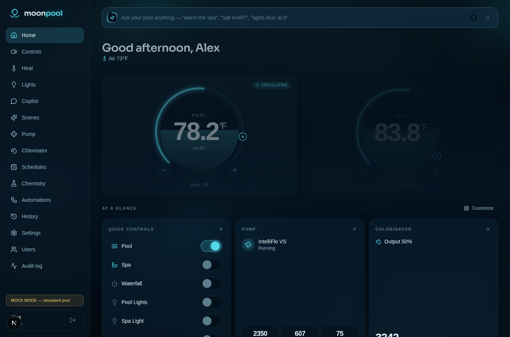
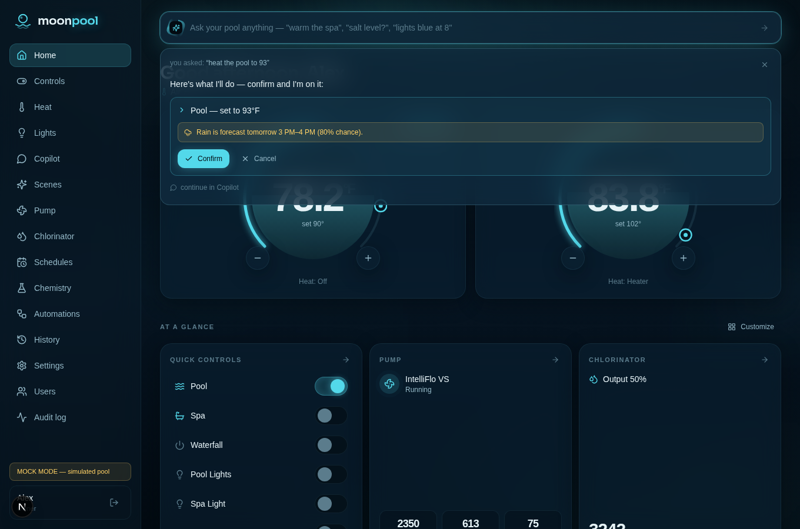
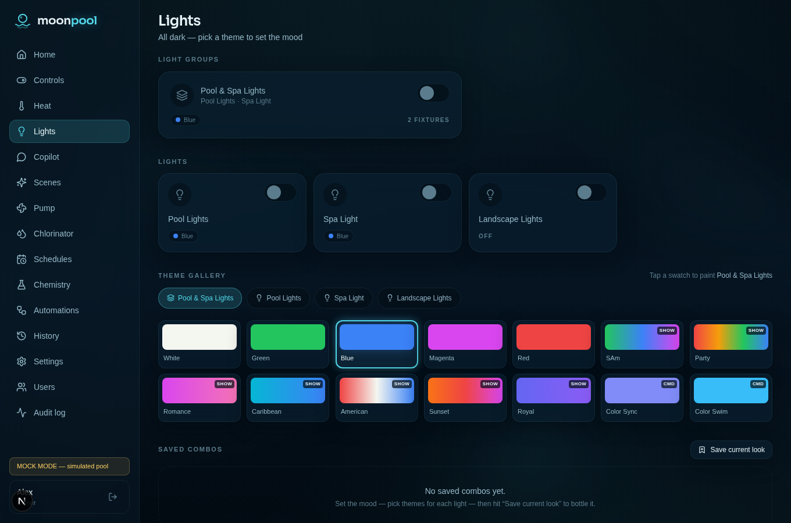

# 🌙 Moonpool

**Self-hosted pool control for Pentair panels. Everything on your Raspberry Pi. Nothing in anyone's cloud.**

Moonpool is a full replacement for Pentair ScreenLogic: a fast, beautiful,
phone-first web app that sits on top of
[nodejs-poolController](https://github.com/tagyoureit/nodejs-poolController)
(njsPC) and adds authentication, roles, automations, history, alerts, voice
control, and an AI copilot. Users, history, scenes, chat threads, the audit
log — all of it lives in a single SQLite file on the Pi.



## Why

njsPC does the heroic work of speaking Pentair's RS-485 protocol — but it has
no authentication and its bundled UIs aren't built for handing to your family
or opening to the internet. Moonpool is the security and experience layer:
the browser never talks to njsPC directly; every request goes through
Moonpool's session- and role-checked API, and every state change is audited.

## Features

- **Night-swim UI** — deep teal-navy glass panels over animated water
  caustics, liquid-fill temperature dials that ripple while heating, spring
  physics everywhere, OLED-black and light themes, custom accent colors.
  Mobile-first PWA: install to your home screen, offline last-known state.
- **Everything ScreenLogic did, better** — circuits & features, thermostat
  dials with heat modes, IntelliFlo RPM control with live watts, IntelliChlor
  output/salt/super-chlorinate, IntelliBrite themes + saved light combos,
  schedule CRUD with a visual week view and conflict warnings.
- **Discovered, not hardcoded** — the UI renders whatever bodies, circuits,
  pumps, chlorinators, light groups and chem controllers your panel reports.
- **Roles** — Owner / Family / Guest with per-circuit and per-scene guest
  visibility. Local accounts, no cloud sign-ups.
- **Automations** — time, cron, sunrise/sunset offsets, temperature
  thresholds, salt low, freeze protect, controller events. Scenes, schedules,
  one-shot timers and the copilot all ride the same engine.
- **Pool Copilot** — natural language in, structured tool calls out. Three
  switchable brains: local Ollama (private, free), OpenAI API key, or **Sign
  in with ChatGPT** (Codex-style OAuth, uses your subscription). The model
  only parses intent — Moonpool validates, bounds-checks, role-checks,
  confirms first, and audits. Plus a UniFi-style **ask bar** on the dashboard.
- **Weather-aware** — keyless Open-Meteo forecasts power confirmations like
  *"Heat the pool? Rain is forecast tomorrow 3–4 PM (80%)"*, an
  evaporation-based **water-level estimator** ("down ~1.4 in, no rain coming —
  add water"), and freeze/heat advisories. Optional
  **WeatherFlow Tempest** integration (local UDP): measured rain, on-site
  wind, and lightning "out of the pool" alerts.
- **Voice** — Siri Shortcuts (5-minute setup, no dev account) and a private
  Alexa custom skill, both with token auth and full auditing.
- **History & insight** — temperature/pump/salt/chemistry charts with daily
  rollups, equipment runtime and energy cost at your $/kWh, chemistry logging
  with dosing math sized to your pool volume.
- **Alerts** — self-hosted web push (no push provider account): faults, freeze
  protect, salt low, chemistry out of range, spa ready, controller offline,
  water level low, lightning.

| | |
| --- | --- |
|  |  |

## Try it in 60 seconds (no hardware)

```bash
git clone <this repo> moonpool && cd moonpool
npm install && cp .env.example .env.local && npm run dev
```

Open http://localhost:3000 — `MOCK_MODE` boots a full pool simulator (pool +
spa, 10 circuits, VS pump, chlorinator, color lights, drifting temperatures)
so every screen, the copilot, and the weather features work with zero
equipment.

## Real setup

**→ [The complete setup guide](docs/SETUP.md)** covers everything: hardware
list, flashing the Pi, RS-485 wiring, Docker bring-up, phone install, remote
access without a VPN app (Cloudflare Tunnel / Tailscale Funnel), push
notifications, copilot brains, Siri & Alexa, Tempest, backups, and running
alongside ScreenLogic during the transition.

The short version:

```bash
ssh pi@moonpool.local
curl -fsSL https://get.docker.com | sh
git clone <this repo> moonpool && cd moonpool
cp .env.example .env && nano .env        # AUTH_SECRET, TZ, lat/long, MOCK_MODE=false
docker compose up -d --build
docker compose exec ollama ollama pull qwen3:1.7b
```

## Architecture

```
                 ┌────────────────────────── Raspberry Pi ──────────────────────────┐
                 │                                                                  │
 Pentair panel ──RS-485──▶ USB adapter ──▶ njsPC (no auth, internal only)           │
                 │                            ▲ REST + Socket.IO                    │
                 │                            │                                     │
 Phone/laptop ◀──HTTPS──▶ Moonpool (Next.js)  │                                     │
      ▲          │        ├─ session auth (scrypt + SQLite)                         │
      │          │        ├─ validated control layer → audit log                    │
 Cloudflare      │        ├─ SSE state bridge (role-filtered)                       │
 Tunnel /        │        ├─ automations worker (cron·sun·thresholds·events)        │
 Tailscale       │        ├─ history sampler + rollups        ┌────────────┐        │
 Funnel          │        ├─ web-push alerts                  │ SQLite     │        │
                 │        ├─ Tempest UDP listener             │ moonpool.db│        │
                 │        └─ copilot engine ──▶ Ollama/OpenAI └────────────┘        │
                 └──────────────────────────────────────────────────────────────────┘
```

Design decisions worth knowing:

- **No external database.** SQLite (`better-sqlite3`, WAL). The idempotent
  schema (`src/server/db/schema.sql`) applies itself at boot — that file *is*
  the migration.
- **One action vocabulary.** Every button, scene, automation, schedule, voice
  command and copilot plan produces the same typed `PoolAction`s, executed by
  one validation + audit path (`src/server/control.ts`).
- **Server-held realtime.** The server owns the single Socket.IO connection to
  njsPC and fans role-filtered snapshots out to browsers over SSE. Optimistic
  UI with automatic rollback on every control.
- **AI can't touch hardware.** Any model — local or cloud — only emits tool
  calls. Bounds checks (setpoints 60–104 °F), circuit whitelisting, role
  rules, confirmation-first cards and auditing all happen in Moonpool.

## Security model

- njsPC and Ollama are never published on host ports — only Moonpool is.
- scrypt password hashing, httpOnly session cookies, login rate limiting.
- Guests only see/touch what an Owner explicitly shares.
- Voice endpoints use single-purpose revocable tokens (hash-stored); the
  Alexa endpoint additionally verifies Amazon's request signatures.
- Secrets (VAPID keys, API keys, OAuth tokens) live only in the Pi's SQLite.

## Development

```bash
npm run dev        # MOCK_MODE dev server
npm run typecheck  # strict TS, no `any`
npm test           # includes the 30-utterance copilot eval (mock parser)
npm run build      # production build (standalone)
```

`COPILOT_LIVE=true npm test` additionally runs the eval against a live LLM
backend. PRs welcome — keep the design language (tokens in
`src/app/globals.css`) and add loading/empty/error/offline states to anything
you build.

## Credits

- [**nodejs-poolController**](https://github.com/tagyoureit/nodejs-poolController)
  by @tagyoureit and contributors — the foundation this stands on. Moonpool
  shares no code with it; it drives njsPC's REST + Socket.IO API. Go star it.
- [Open-Meteo](https://open-meteo.com) — keyless weather + evapotranspiration.
- [WeatherFlow Tempest](https://weatherflow.com/tempest-weather-system/) — UDP
  broadcast reference for the local station integration.
- Next.js, Tailwind, Motion, Radix, Recharts, TanStack Query, dnd-kit,
  better-sqlite3, Ollama.

## Disclaimer

This software controls physical equipment — heaters, pumps, valves,
chlorinators. It is provided **as is**, without warranty of any kind. Keep
your panel's built-in safeties in place, supervise early use, and understand
that you run it at your own risk. Not affiliated with Pentair, OpenAI,
Amazon, Apple, or WeatherFlow.

## License

[MIT](LICENSE)
